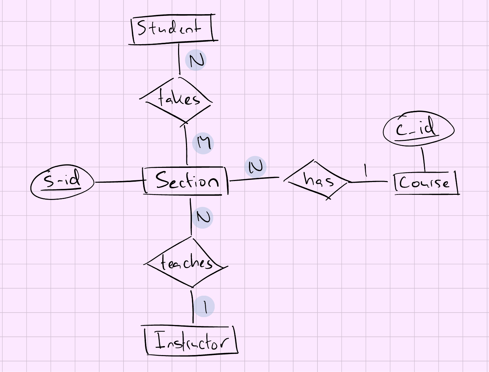

# Lecture 2: The Entity Relationship Model

- A **database** is a collection of data which describes one or many real-word enterprises
  - ex: A university database might contain information about **entities** like students and courses, and **relationships** like a student's enrollment in a course
- A **DBMS** is a software package designed to store and manage databases
  - ex: DB2, Oracle, MS SQL Server, MySQL and Postgres
- A **database system** = ```(Big) Data + DBMS + Application Programs```
- A **data model** is a collection of *high-level data description* constructs that hide many low-level storage details
  - A widely used data model is the **entity-relationship (ER) model**. It allows users to pictorially denote entities and the relationships among them

## The Relational Model

- One of the most widely used models today
- Central data description: **relation**
- A relation is basically a **table** (or a set) with **rows** (or records or tuples) and **columns** (or fields or attributes)
- Every relation has a **schema**, which describes the columns of a relation
- Conditions that records in a relation must satisfy: **integrity constraints**

Let us consider the student entity in a university database:\
**Students**(<ins>**sid**</ins>: string, **name**: string, **login**: string: **dob**: string, **gpa**: real) &rarr; ***schema***\

An instance of a **Students** relation:
| sid | name | login | dob | gpa |
| --------------- | --------------- | --------------- | --------------- | --------------- |
| 512412 | Julia | julia@mail.concordia.ca | 18-09-1995 | 3.5 |
| 512311 | Jones | jones@mail.concordia.ca | 01-12-1994 | 3.2 |
| 512111 | Maria | maria@mail.concordia.ca | 03-08-1995 | 3.85 |

**sid** &rarr; *Integrity Constraint*: each student has a unique value

## Levels of Abstraction

- Data in DBMS is described at 3 levels of abstraction
  - **Conceptual** schema: describes data in terms of specific data model
  - **Physical** schema: specifies how data described in the conceptual schema are stored on secondary storage devices
  - **External** schema (or **views**): allow data access to be customized at the level of individual users or group of users

## Views

- A view is conceptually a relation
- Records in a view are computed as needed and usually not stored in a DBMS

ex: University Database
| Conceptual Schema | Physical Schema | External Schema(View) |
| --------------- | --------------- | --------------- |
| <ul><li>**Students**(<ins>**sid**</ins>: string, **name**: string, **login**: string, **dob**: string, **gpa**: real)</li><li>**Courses**(<ins>**cid**</ins>: string, **cname**: string, **credits**: integer)</li><li>**Enrolled**(<ins>**sid**</ins>: string, <ins>**cid**</ins>: string, **grade**: string)</li></ul>| <ul><li>Relations stored as heap files</li><li>Index on first column of Students</li></ul>| Students can be allowed to find out course enrollments: <ul><li>**Course_info**(**cid**: string, **enrollment**: integer)</li></ul> |

## Iterating: Data Independence

- One of the most important benefits of using a DBMS is **data independence**
- 2 properties:
  - **Logical data independence**: users are shielded from changes in the conceptual schema (ex: add/drop a column in a table)
  - **Physical data independence**: users are shielded from changes in the physical schema (ex: add index or change record order)

## People Who Work With databases

1. End users
    - Store and use data in DBMSs
    - Usually not computer professionals
2. Application programmers
    - Develop apps that facilitate usage of DBMSs for end-users
    - Computer professionals
3. Database Admins (DBAs)
    - Design conceptual and physical schemas
    - Ensure security and authorization
    - Ensure data availability and recovery from failures
    - Perform database tuning
4. Implementers
    - Build DBMS software for vendors like IBM and Oracle
    - Computer professionals
5. Researchers
    - Innovate new ideas which address evolving and new challenges

## Database Design

- **Requirements Analysis**
  - User's needs
- **Conceptual Design**
  - High-level description of the data
- **Logical Design**
  - Conversion of an ER design into a relational database schema
- **Schema Refinement**
  - Normalization (restructuring tables to ensure desirable properties)
- **Physical Design**
  - Building indexes and clustering some tables
- **Security Design**
  - Access controls

## Entities and Entity Sets

- **Entity**:
  - A real-world object distinguishable from other objects in an enterprises
    - ex: University, Students and Faculty
  - Described using a set of **attributes**
- **Entity set**:
  - A collection of similar entities
  - All entities in an entity set have the same set of attributes (until we consider **ISA** hierarchies!)
  - Each entity set has a **key**
  - Each attribute has a **domain**

## Tools and ER Diagram


## Relationship and Relationship Sets

- **Relationship**:
  - Association among 2 or more entities
    - ex: Essam is teaching SOEN 363
  - Described using a set of attributes
- **Relationship set**:
  - Collection of similar relationships
  - Same entity set could participate in different relationship sets, or in different "roles" in the same set

## More Tools and ER Diagrams


## Ternary relationships

- Suppose that departments have offices at different locations and we want to record the locations at which each employee works
- Consequently, we must record an association between an employee, a department and a location


## Key Constraints

- Consider the **Employees** and **Departments** entity sets with a **Manages** relationship set
  - An employee can *work in many* departments
  - A department can *have many* employees
  - This restriction is an example of a **key constraint**
  - *Key constraints are denoted by thin arrows* (&larr;)

## Cardinalities

- Entities can be related to one another as:
  - one-to-one
  - one-to-many
  - many-to-many


## A Working Example

- **Requirements**: Students take courses offered by instructors; a course may have multiple sections; one instructor per section
- **How to start?**
  - Nouns &rarr; entity sets
  - Verbs &rarr; relationship sets



## Participation Constraints

- Consider again the **Employees** and **Departments** entity sets as well as the **Manages** relationship set
  - Should every department have a manager?
  - If so, this is a **participation constraint**
  - Such a constraint entails that every Departments entity must appear in an instance of the Manages relationship
  - The participation of Departments in Manages is said to be **total** (vs **partial**)


