# Lecture 11: DBMS Internals - Part 1

## Motivation

Consider a file of student records sorted by GPA:

**Data File**:
| Page 1 | Page 2 | Page 3 | ... | Page N |
| ------ | ------ | ------ | --- | ------ |

How can we answer a *range selection* (ex: *Find all students with a GPA higher than 3.0*)?
- What about doing a **binary search** followed by a **scan**
  - ***Yes, but...***
- What if the file becomes *very* large?
  - Cost is proportional to the number of pages fetched
  - Hence, may become very slow!
- What about creating an ***index file*** (with one entry per page) and do binary search there?

**Index File**:
| K<sub>1</sub> | P<sub>1</sub> | K<sub>2</sub> | P<sub>2</sub> | ... | K<sub>N</sub> | P<sub>N</sub> |
| - | - | - | - | - | - | - |

**Data File**:
| Page 1 | Page 2 | Page 3 | ... | Page N |
| ------ | ------ | ------ | --- | ------ |

- Index Entry = <first key on the page, pointer to the page>
- P1 &rarr; Page 1
- P2 &rarr; Page 2

But, what if the index file becomes also **very** large?

**Repeat recursively!!!**

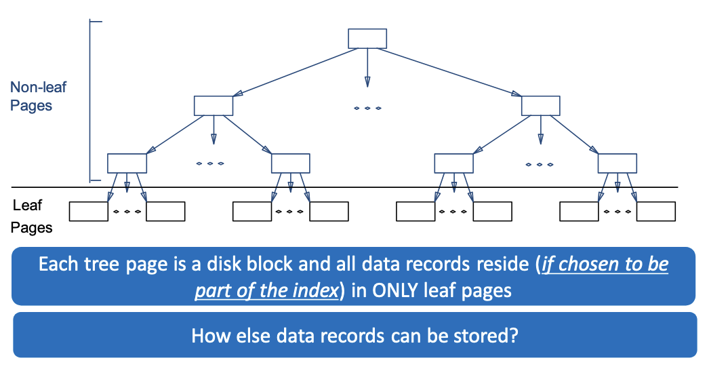

## Where to Store Data Records?

In general, 3 *alternatives* for **data records* (each referred to as ***K\****) can be pursued:
  - **Alternative 1**: K* is an actual data record with key **k**
    - *Leaf pages contain the actual data (i.e., the data records)*
  - **Alternative 2**: K* is a **<k, rid>** pair, where **rid** is the record id of a data record with search key **k**
    - *Leaf pages contain the <key, rid> pairs and actual data records are stored in a separated file*
  - **Alternative 3**: K* is a **<k, rid-list>** pair, where **rid-list** is a list of rids of data records with search key **k**
    - Leaf pages contain the <key, rid-list> pairs and actual data records are stored in a separate file

> [!TIP]
> The choice among these alternatives is orthogonal to the *indexing technique*

## Clustered vs Unclustered Indexes

- Indexes can be either **clustered** or **unclustered**
- **Clustered Indexes**:
  - When the ordering of data records is the same as (or close to) the ordering of entries in some index
- Unclustered indexes:
  - When the ordering of data records differs from the ordering of entries in some index
- Is an index that uses **Alternative 1** clustered or unclustered? ***UNCLUSTERED***
- Is an index that use **Alternative 2 or 3** clustered or unclustered? ***CLUSTERED*** *only if data records are sorted on the search key field*
- In practice:
  - A *clustered* index is an index that uses **Alternative 1**
  - Indexes that use **Alternative 2 or 3** are *unclustered*

| Clustered   | Nonclustered    |
|--------------- | --------------- |
| Only 1 allowed per table   | Up to 249 allowed per table |
| Physically rearranges the data in the table to conform to the index constraints | Creates a separate list of key values with pointers to the location of the data in the data pages|
| For use on columns that are frequently searched for ranges of data | For use on columns that are searched for single values |
| For use on columns with low selectivity | For use on columns with high selectivity |

**CLUSTERED**:
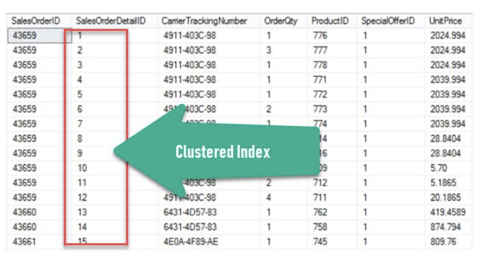

**NONCLUSTERED**:
```sql
CREATE INDEX myIndex
ON SalesData(ProductID, OrderQty)
```
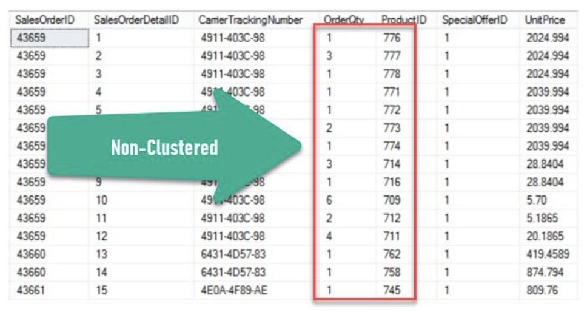

## ISAM Trees

Indexed Sequential Access Method (ISAM) trees are *static*
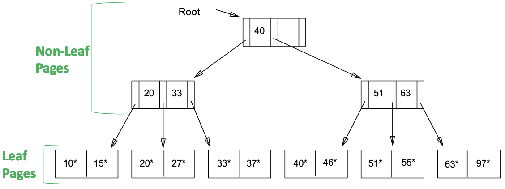

### ISAM Trees: Page Overflows

What if there are a lot of insertions after creating the tree?
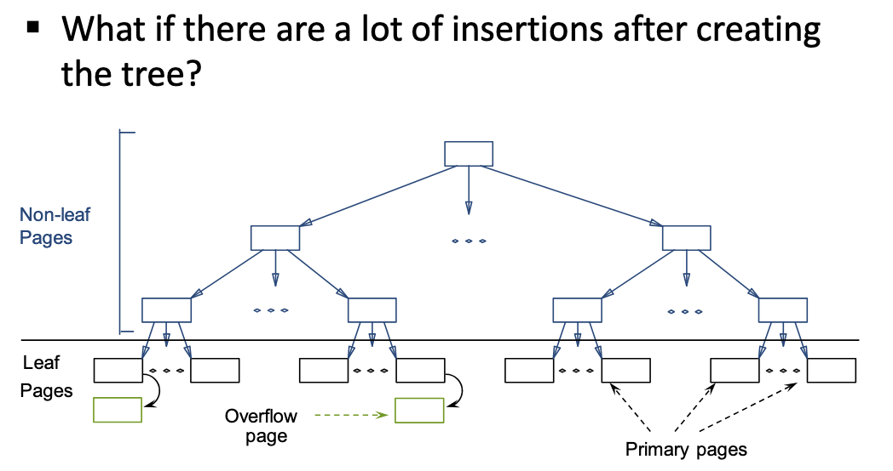

### ISAM: Searching for entries

- Search begins at root and key comparisons direct it to a leaf
- Search for **27**

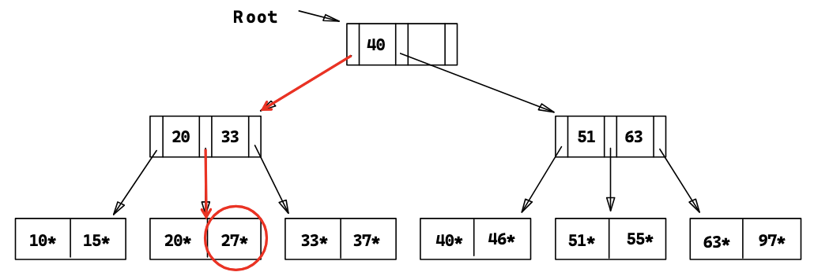

### ISAM: Inserting Entries

- The appropriate page is determined as for a sarch and the entry is inserted with overflow pages added if necessary
- Insert **23**

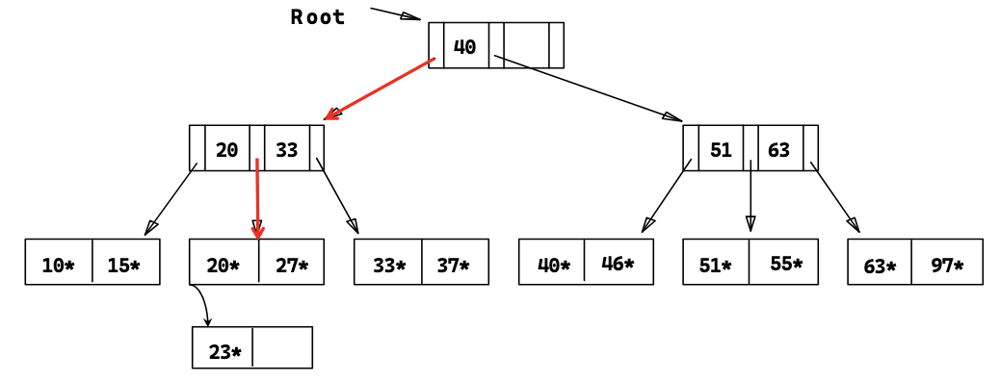

- Insert **48**

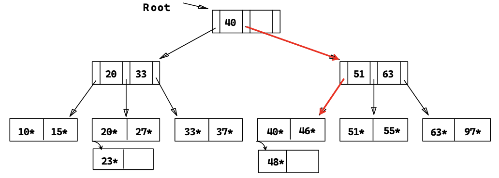

- Insert 41

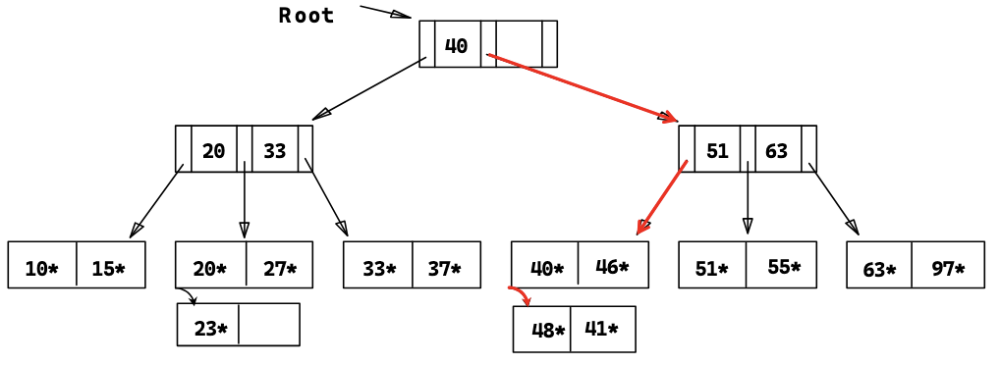

- Insert 42

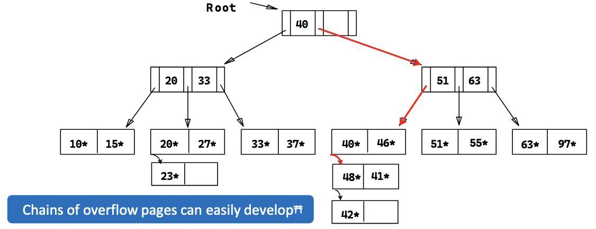

### ISAM: Deleting Entries

- The appropriate page is determined as for a search and the entry is deleted *with ONLY overflow pages removed when becoming empty*
- Delete **42**

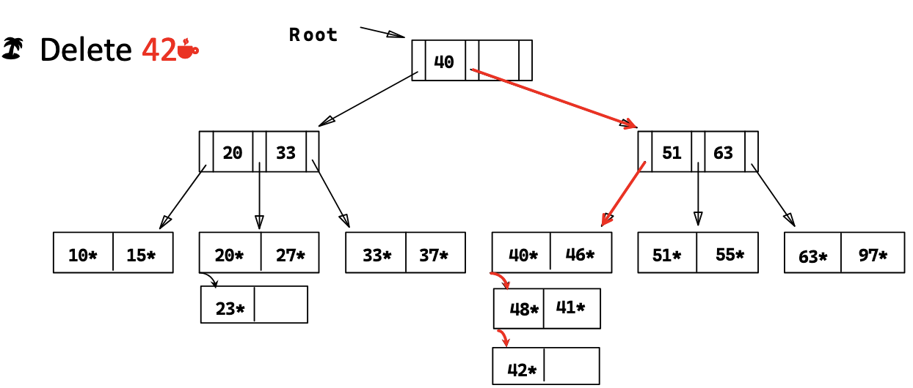
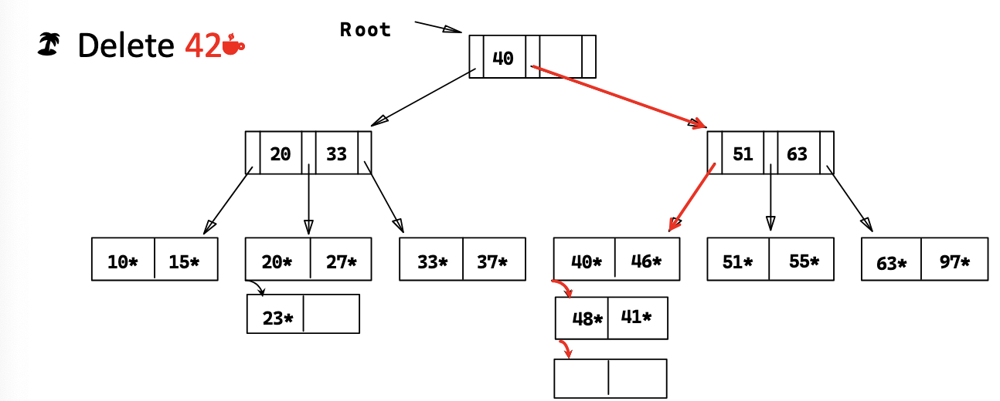
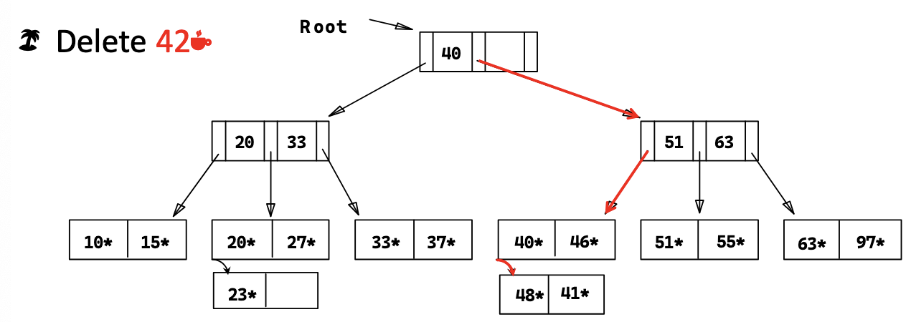

- Delete 51

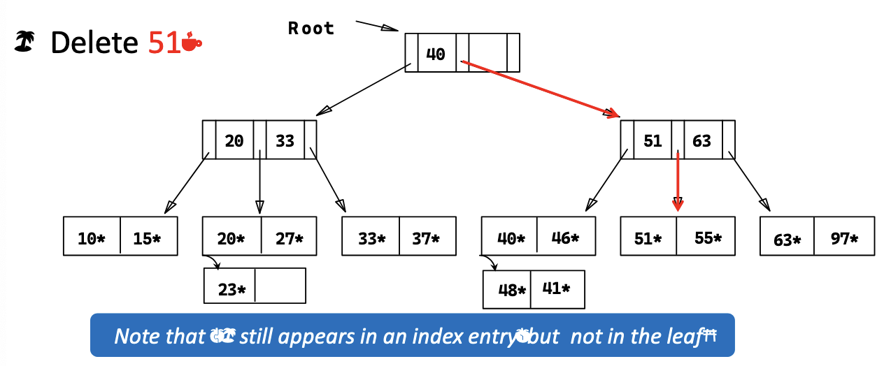

- Delete 55

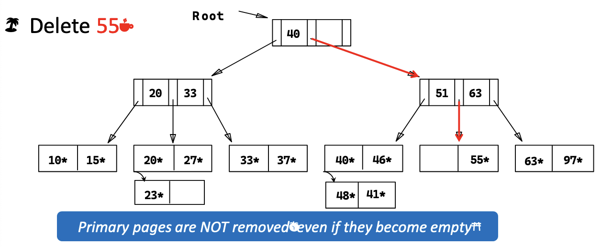

### ISAM: Some Issues

- Once an ISAM file is created, insertions and deletions affect only the contents of leaf pages (i.e., ***ISAM is a static structure!***)
- Since index-level pages are *never* modified, there is no need to *lock* them during insertions/deletions
  - *Critical for concurrency!*
- Long overflow chains can develop easily
  - *The tree can be initially set so that ~20% of each page is free*
- If the data distribution and size are relatively static, ISAM might be a good choice to pursue!

