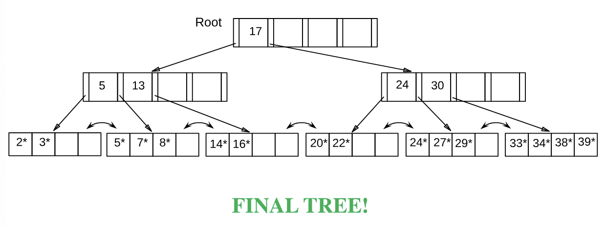
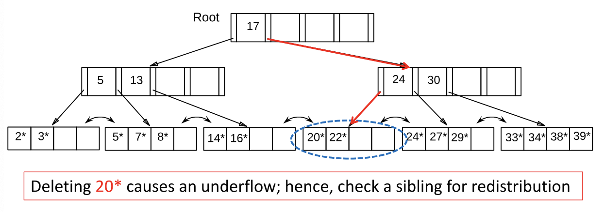
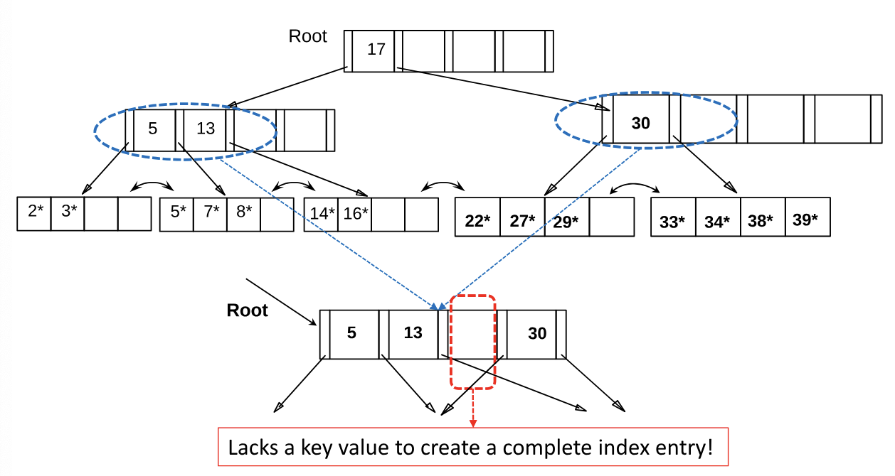

# Lecture 12: DBMS Internals - Part 2

## Dynamic Trees

- ISAM indices are static
  - Long overflow chains can develop as the file grows, leading to poor performance
- This calls for more flexible, *dynamic* indices that adjust gracefully to insertions and deletions
  - No need to allocate the leaf pages sequentially as in ISAM
- Among the **most succesful** dynamic index schemes is the ***B+ Tree***

## B+ Tree Properties

- Each node in a B+ tree of order **d** (*this is a measure of the capacity of a tree*)
  - Has at most **2d** keys
  - Has at least **d** keys (*except the root, which may have just 1 key*)
  - All leaves are on the *same level*
  - Has exactly **n-1** keys if the number of pointers is **n**

### B+ Tree: Searching for Entries

Search begins at root, and key comparisons direct it to a leaf (as in ISAM)

EXAMPLE 1: Search for entry **5\***

EXAMPLE 2: Search for entry **15\***

### B+ Tree: Inserting Entries

- Find correct leaf **L**
- Put data entry onto **L**
  - If **L** has enough space, done!
  - Else, *split* **L** into **L** and a new node **L2**
    - Re-partition entries evenly, *copying up* the middle key
- Parent node may *overflow*
  - *Push up* middle key (splits "grow" trees; a root split increases the height of the tree)

#### B+ Tree: Examples of Insertions

##### Insert entry **8\***:

##### Splitting vs Redistributing

- **Leaf Nodes**
  - Previous and next-neighbor pointers must be updated upon insertions (*if splitting is to be pursued*)
  - Hence, checking whether redistribution is possible does not increase I/O
  - Therefore, if a sibling can spare an entry, redistribute
- **Non-Leaf Nodes**
  - Checking whether redistribution is possible *usually* increases I/O
  - Splitting non-leaf nodes typically pays off!

### B+ Tree: Deleting Entries

- Start at root, find leaf **L** where entry belongs
- Remove the entry
  - If **L** is at least half-full, *done*!
- If **L** *underflows*
  - Try to *redistribute* (i.e., borrow from a *rich sibling* and *copy up* its **lowest key**)
  - If redistribution fails, **merge** **L** and a *poor sibling*
    - Update parent
    - And possible merge, recursively

#### B+ Tree: Examples of Deletion

##### Delete **19\***:

##### Delete **20\***:

##### Delete **24\***:

