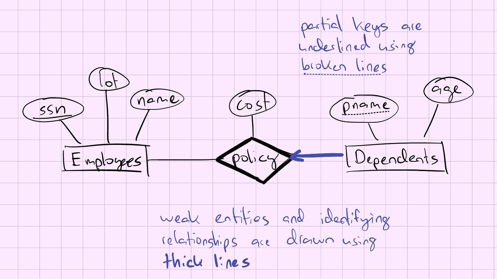
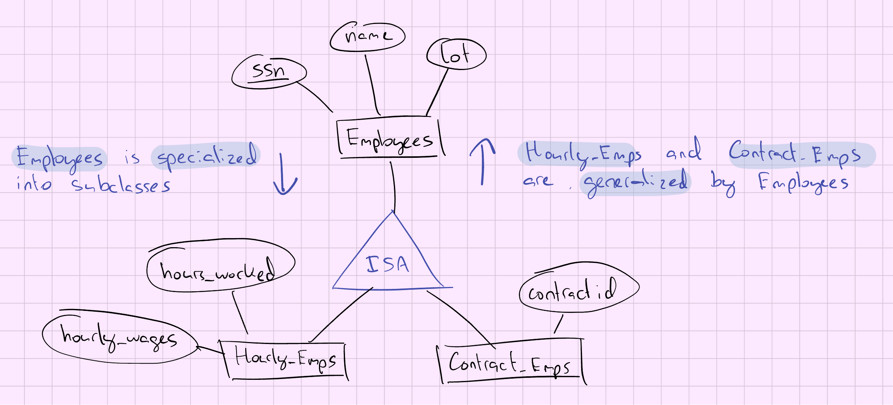
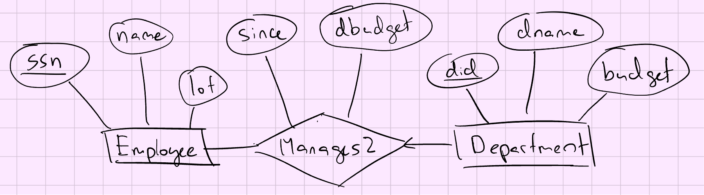
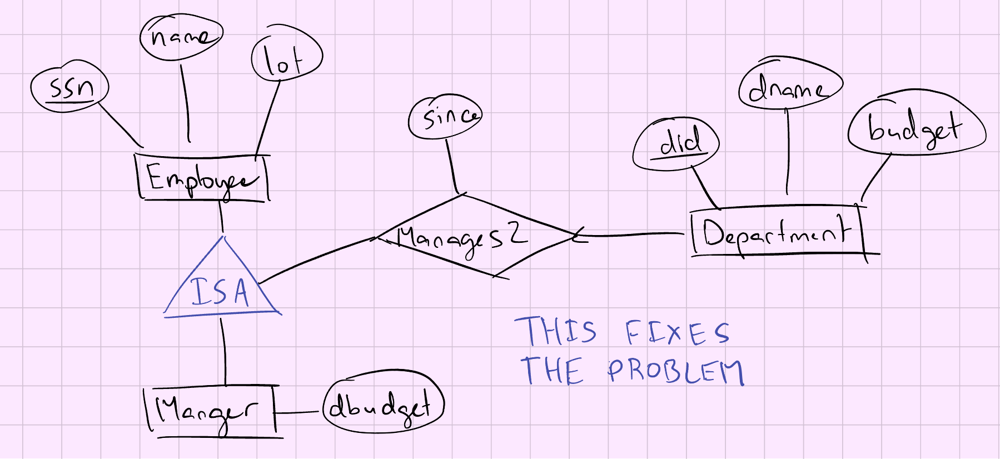

# Lecture 3: The Relational Model

## Weak Entities

- A **weak entity** can be identified uniquely only by considering the primary key of *another entity*
  - Owner entity set and weak entity set must participate in a one-to-many relationship set (one owner, many weak entities)
  - Weak entity set must have total participation in this **identifying relationship set**
- The set of attributes of a weak entity set that uniquely identifies a weak entity for a given owner entity is called **partial key**

ex:

- **Dependents** has no unique key of its own
  - It is a weak entity with partial key **pname**
  - **Policy** is an identifying relationship set
  - **pname** + **ssn** are the primary key of **Dependents**

## ISA (is a) Hierarchies

- Entities in an entity set can sometimes be classified into subclasses (somewhat similar to OOP languages)
- If we declare B **ISA** A, every B entity is also considered to be an A entity

ex:

### Overlap and Covering Constraints

- **Overlap constraints**
  - Can an entity belong both **B** and **C**
  - ex:
    - Can John be in *Hourly_Emps* and *Contract_Emps*? **no**
    - Can John be in *Contract_Emps* and in *Senior_Emps*? **yes** &rarr; ***Contract_Emps OVERLAPS Senior_Emps***
- **Covering constraints**
  - Can an **A** entity belong to neither **B** nor **C**
  - ex:
    - Does every one in Employees belong to one of its subclasses? **no**
    - Does every Motor_Vehicles entity have to be either a Motorboats entity or a Cars entity? **yes** &rarr; ***Motorboats AND Cars COVER Motor_Vehicles***

### More Details on ISA Hierarchies

- Attributes are *inherited* (i.e., if B **ISA** A, the attributes defined for a B entity are the attributes for A *plus* B)
- We can have **many** levels of an ISA hierarchy
- Reasons for using ISA:
  - Add descriptive attributes specific to a subclass
  - Identify entities that participate in a relationship

## Entity vs Attribute

- Should *address* be an attribute of Employees or an entity (connected to Employees by a relationship)
- This depends upon the use we want to make of address information, and the semantics of the data
  - If we have several addresses per employee, *address* must be an entity (since attributes cannot be **set-valued**)
  - If the structure (city, street, etc...) is important (ex: we want to retrieve employees in a given city), *address* must be an entity

## Entity vs Relationship

- Consider the following ER diagram, whereby a manager gets a separate discretionary budget for each department

- What if a manager gets a discretionary budget that covers all managed departments?
  - Redundant data
  - Misleading

fix:

## Binary vs Ternary Relationships
